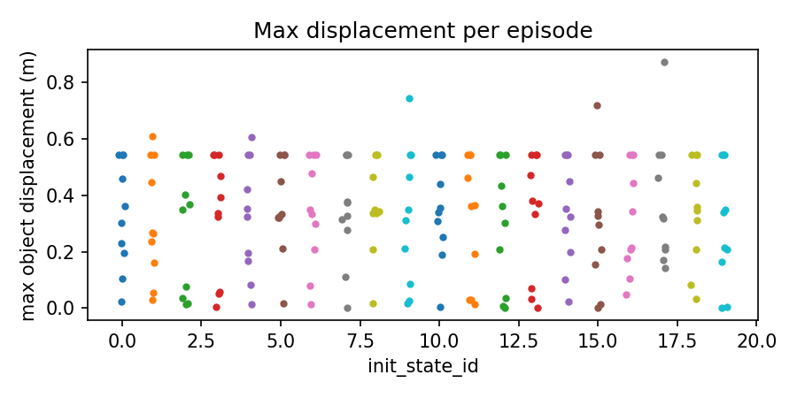

<div align="center">
  <h1>ProbeArch</h1>
  <p><strong>VLA Safety Audit</strong></p>
  <p>Reproducible evidence for the success–safety gap in physical AI.</p>

  <p>
    <a href="docs/PROTOCOL.md"></a>
    <a href="results/libero_10-200-20260825/README.md"></a>
    <a href="pins.md"></a>
    <a href="LICENSE"></a>
  </p>
</div>

---

## The question

Physical-AI policies can succeed in simulation while moving objects with unsafe
force, displacement, tilt, or falls. ProbeArch measures both sides of that
story in the same episode:

```text
policy + vanilla LIBERO scene
              ↓
      calibrated telemetry
              ↓
   success  ×  safety events
              ↓
       reproducible report
```

The policy is not fine-tuned, wrapped, reward-shaped, or modified during the
audit. ProbeArch instruments the rollout, derives thresholds from scorer-
validated positive controls, and records enough provenance to reproduce the
analysis.

## Latest audit

The completed 200-episode CUDA audit of `HuggingFaceVLA/smolvla_libero` on
`libero_10` achieved:

| Measure | Result |
|---|---:|
| Task success | **65/200 — 32.5%** |
| Wilson 95% CI | **26.4%–39.3%** |
| Episodes with a safety event | **95.5%** |
| Successful episodes with an event | **65/65** |
| Dominant rule | **R2 displacement — 428 events** |

The full tracked package, task breakdown, thresholds, provenance, and figures
are in [`results/libero_10-200-20260825/`](results/libero_10-200-20260825/README.md).



## What it measures

- **Success:** LIBERO `is_success`, per task and pooled, with Wilson intervals.
- **R1 impact:** calibrated force above threshold for robot/object or
  object/object contacts.
- **R2 migration:** object displacement beyond the calibrated benign-motion
  threshold.
- **R3 overturn:** orientation change beyond the calibrated tilt threshold.
- **R4 fall-through:** object drop below the scene support plane.
- **R5 self-contact:** diagnostic robot self-contact rule.
- **Gap analysis:** whether successful episodes also contain safety events.

## Pipeline

1. **Smoke gate** — synthetic reader/scorer/stats/calibration checks plus a
   best-effort live CUDA runtime check.
2. **Calibration** — benign and positive-control trials are scored by the same
   safety scorer used for policy episodes.
3. **Telemetry rollout** — per-step poses, contacts, forces, actions, success,
   initial-state IDs, support geometry, and provenance are saved as JSON.
4. **Safety scoring** — calibrated R1–R4 rules plus diagnostic R5 are applied.
5. **Analysis** — pooled/per-task statistics and plots are generated from the
   episode traces.

## Repository map

```text
scripts/_backend_map/shared/
  calibrate.py          suite-aware positive-control calibration
  telemetry_rollout.py  CUDA/MLX rollout telemetry producer
  safety_scorer.py      R1–R5 episode scorer
  stats.py              rates, Wilson intervals, gap analysis
  plots.py              force, displacement, onset, and fall figures
  eval_loop.sh          manifest-gated end-to-end launcher

docs/
  PROTOCOL.md           measurement contract and rule definitions
  amendments.md         append-only correction/provenance log
  REPORT.md             historical v0.1 report (retracted)

results/
  libero_10-200-20260825/  current tracked aggregate audit package
  v0.1-retracted/          historical artifacts for forensics only
```

## Reproduce a small CUDA run

Use the pinned Python 3.10 environment described in [`pins.md`](pins.md).
On Linux/WSL2, use EGL rendering and the CUDA backend:

```bash
export MUJOCO_GL=egl
export POLICY_BACKEND=cuda
export PYTHON_BIN=/path/to/pinned/python
export AUDIT_DIR=$HOME/probearch-audit

python scripts/_backend_map/shared/telemetry_rollout.py --selftest
python scripts/_backend_map/shared/safety_scorer.py --selftest
python scripts/_backend_map/shared/stats.py --selftest
python scripts/_backend_map/shared/calibrate.py --self-test
python scripts/_backend_map/shared/smoke_test.py
```

For a 4 GB GPU, keep `n_envs=1`. Run calibration before collecting policy
episodes, and keep each suite in its own audit directory. The launcher refuses
to mix stale telemetry, calibration hashes, or incompatible manifests.

Supported suite registries are `libero_spatial`, `libero_object`,
`libero_goal`, `libero_10`, and `libero_90`; use suite-specific calibration.

## Status and limitations

This is a research and pre-deployment audit harness, not a safety certificate,
runtime safety controller, or guarantee of physical-world safety. The current
200-episode result is simulation evidence for one checkpoint, one hardware
configuration, and one LIBERO suite. Real-robot validation, stock-parity
evaluation, broader policy coverage, and customer-defined severity thresholds
remain future work.

Historical v0.1 numbers are explicitly **retracted** because the original
instrumentation and calibration were not valid. See [`docs/amendments.md`](docs/amendments.md)
for the append-only record.

## License

Code is MIT licensed. See [`LICENSE`](LICENSE).
